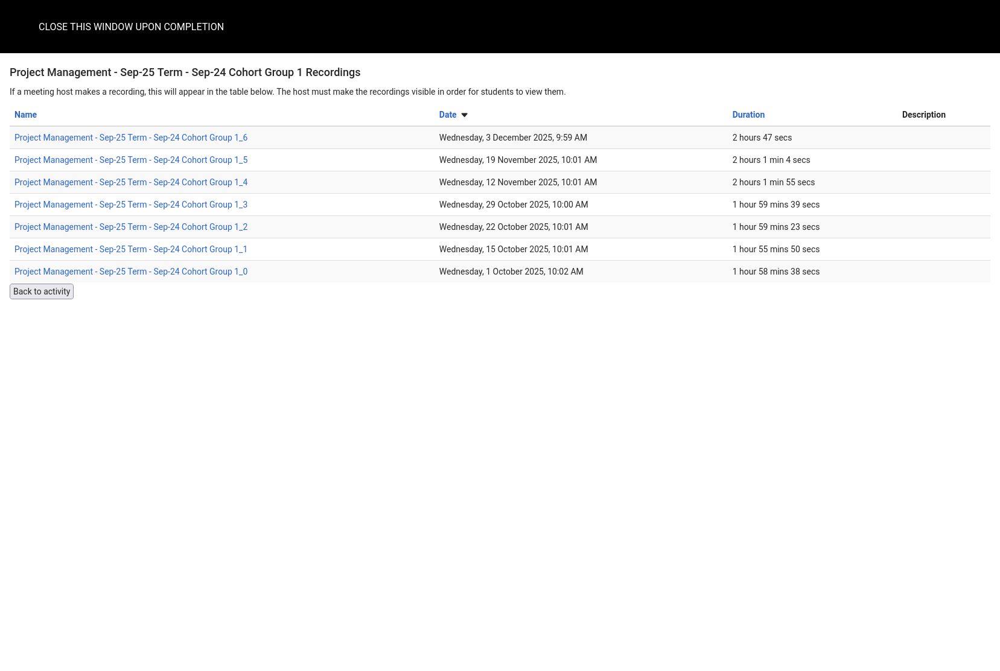
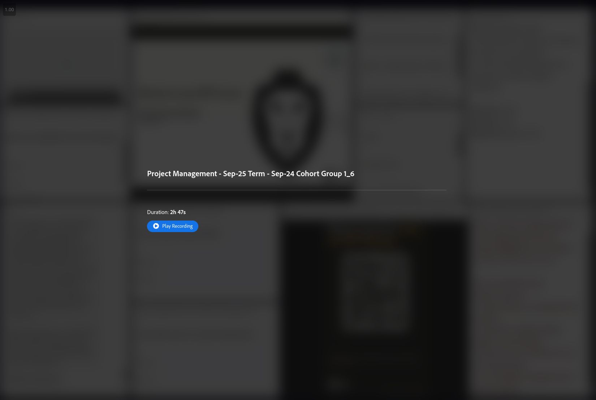

<p align="center">
  
</p>

<h1 align="center">AdobeConnectDL</h1>

[](https://github.com/keanucz/AdobeConnectDL/releases)
[](https://github.com/keanucz/AdobeConnectDL/actions)
[](./LICENSE)

This is a Go CLI (using Cobra) that automatically grabs the MP4 and VTT URLs from an Adobe Connect recording page, downloads them, merges everything together, and also spits out a nice `.txt` transcript and other metadata alongside the recording. 🎬

I wrote this because my university uses Adobe Connect to host lectures and store recordings, and for some reason you can only view recordings online, not download them. Given that I'm sometimes in places with no Internet access or terrible connectivity, I built this tool to solve my own (and my fellow students') woes so we can watch our lectures anywhere, any time. 🎓

## ✨ What it does

For each Adobe Connect recording URL you give it, AdobeConnectDL will:

- 🔻 Locate the backing MP4 and subtitle (VTT) URLs from the recording page
- 📥 Download the recording and subtitles
- 🎛️ Embed subtitles into the video
- 🗂️ Extract and save:
  - Transcript (`transcript.txt`)
  - Chat log (`chat_log.txt`)
  - Captions (`captions.vtt`)
  - Attached documents (plus a `documents.txt` index)
  - Metadata (`metadata.json`)
- 📁 Put everything into a neatly named directory for that recording

## 🚀 Usage

1. **Download the binary**

   Grab the binary from the releases page for your platform. ⬇️  

   I’ve embedded a copy of `ffmpeg`/`ffprobe` for each platform, so you shouldn’t need to install any external dependencies.

2. **Open the recordings list**

   For any lecture you want to download, go to the Adobe Connect recordings page (pictured below):

   

3. **CRUCIAL STEP: open the specific recording**

   Click on the **recording** you want to download.

   In your browser’s URL bar you should see something like:

   ```text
   https://your-domain.adobeconnect.com/recording-id/?session=YOUR_SESSION_TOKEN
   ```

   This is the URL you need to pass to `adobeconnectdl`.  
   (If you use the generic list page URL instead, the tool won’t work.)

   

4. **Run `adobeconnectdl`**

   Feed the recording URL into the CLI and let it do its thing:

   ```bash
   ❯ ./adobeconnectdl download "https://your-domain.adobeconnect.com/recording-id/?session=YOUR_SESSION_TOKEN"
   INFO Starting batch download count=1
   INFO FFmpeg located path=/usr/bin/ffmpeg
   INFO Processing recording 1/1 url="https://your-domain.adobeconnect.com/recording-id/?session=YOUR_SESSION_TOKEN"
   INFO Downloading video progress=5% downloaded="16.4 MB" total="328.0 MB"
   INFO Downloading video progress=10% downloaded="32.8 MB" total="328.0 MB"
   INFO Downloading video progress=15% downloaded="49.2 MB" total="328.0 MB"
   INFO Downloading video progress=20% downloaded="65.6 MB" total="328.0 MB"
   INFO Downloading video progress=25% downloaded="82.0 MB" total="328.0 MB"
   INFO Downloading video progress=30% downloaded="98.4 MB" total="328.0 MB"
   INFO Downloading video progress=35% downloaded="114.8 MB" total="328.0 MB"
   INFO Downloading video progress=40% downloaded="131.2 MB" total="328.0 MB"
   INFO Downloading video progress=45% downloaded="147.6 MB" total="328.0 MB"
   INFO Downloading video progress=50% downloaded="164.0 MB" total="328.0 MB"
   INFO Downloading video progress=55% downloaded="180.4 MB" total="328.0 MB"
   INFO Downloading video progress=60% downloaded="196.8 MB" total="328.0 MB"
   INFO Downloading video progress=65% downloaded="213.2 MB" total="328.0 MB"
   INFO Downloading video progress=70% downloaded="229.6 MB" total="328.0 MB"
   INFO Downloading video progress=75% downloaded="246.0 MB" total="328.0 MB"
   INFO Downloading video progress=80% downloaded="262.4 MB" total="328.0 MB"
   INFO Downloading video progress=85% downloaded="278.8 MB" total="328.0 MB"
   INFO Downloading video progress=90% downloaded="295.2 MB" total="328.0 MB"
   INFO Downloading video progress=95% downloaded="311.6 MB" total="328.0 MB"
   INFO Downloading video progress=100% downloaded="328.0 MB" total="328.0 MB"
   INFO Download complete title="Introduction to Software Engineering - Lecture 12" location="Introduction to Software Engineering - Lecture 12"
   INFO Video saved path="Introduction to Software Engineering - Lecture 12/recording.mp4"

   ✓ Saved recording "Introduction to Software Engineering - Lecture 12" to Introduction to Software Engineering - Lecture 12

   ━━━━━━━━━━━━━━━━━━━━━━━━━━━━━━━━━━━━━━━━
   Download Summary: 1 successful, 0 failed

   ❯ ls Introduction\ to\ Software\ Engineering\ -\ Lecture\ 12
   captions.vtt  chat_log.txt  documents  documents.txt  metadata.json  raw  raw.zip  recording.mp4  transcript.txt
   ```

## 📦 Outputs at a glance

For each recording, you’ll typically get a directory like:

- 🎥 `recording.mp4` – the final MP4 with subtitles baked in
- 💬 `captions.vtt` – raw subtitles
- 📝 `transcript.txt` – plain-text transcript
- 🗨️ `chat_log.txt` – chat window contents with names & timestamps
- 📄 `documents/` – any attached documents from the session
- 📑 `documents.txt` – quick index of attached documents
- 🧾 `metadata.json` – assorted recording metadata
- 🔍 `raw.zip` / `raw/` – original Adobe Connect assets (FLV/XML etc.), if you want to poke at them

## 🎬 FFmpeg binaries

Embedded `ffmpeg` binaries shipped with AdobeConnectDL are taken from:

- macOS (Apple silicon & Intel), ffmpeg **8.0**: [osxexperts.net](https://osxexperts.net/)
- Windows, ffmpeg **8.0.1**: [Gyan FFmpeg builds](https://www.gyan.dev/ffmpeg/builds/)
- Linux amd64, ffmpeg build **autobuild-2025-12-08-12-55**: [BtbN FFmpeg builds](https://github.com/BtbN/FFmpeg-Builds/releases/tag/autobuild-2025-12-08-12-55)

### FFmpeg versions & licenses

- All embedded binaries above are prebuilt distributions of FFmpeg obtained from the listed sources.
- FFmpeg itself is licensed under the LGPL/GPL; see the official FFmpeg license page for details:
   - https://ffmpeg.org/legal.html

## 🧠 Technical details (under the hood)

There are basically two ways to download Adobe Connect recordings:

1. **Direct MP4 & VTT extraction (what AdobeConnectDL uses)**  
   Parse the lecture recording HTML/JavaScript, pull out the MP4 and VTT URLs, and download them directly.

2. **“Raw assets” ZIP + reconstruction (the painful way)**  
   Download a ZIP file containing all the original Flash Video (FLV) chunks and XML files, then try to reconstruct the timeline from that.

I originally explored option 2 (and so did Codex). It turns out that trying to combine several randomly ordered FLV files into a coherent timeline is... not fun.

However, that ZIP **does** contain some useful extra data: the transcript with **unanonymised names** and timestamps for the chat window, plus various session metadata and attachments. That’s why the tool still downloads and keeps those raw assets: they’re handy for preserving captions, chat logs, transcripts, attached documents, and so on.

Since Adobe Connect already provides an MP4 stored in S3 anyway, it’s far easier (and much less fragile) to:

- Use the MP4 as the canonical recording
- Pull subtitles, chat logs, transcripts, and documents from the raw assets
- “Pad” that extra metadata around the clean MP4 output

This gives you a single, portable video file plus all the sidecar data you might want for later processing or archival. 📦
